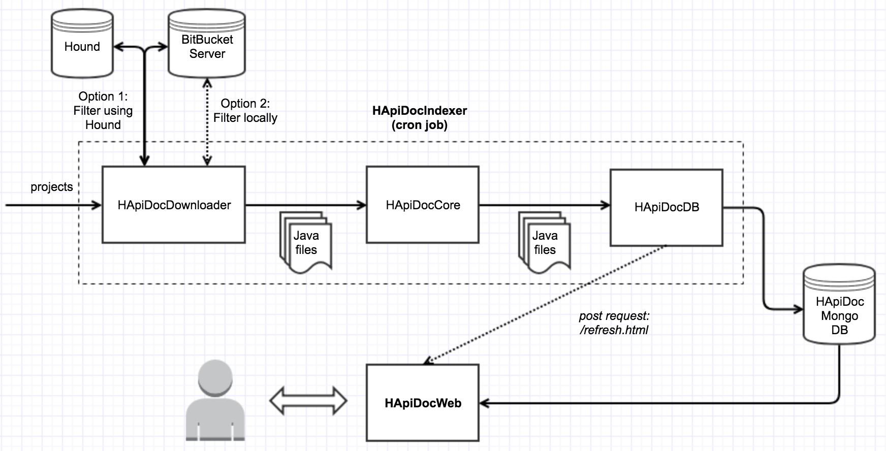

## Overview
HApiDocWeb is the web service behind HApiDoc.

## What is HApiDoc?
HApiDoc builds on top of [CLAMS](https://mast-group.github.io/clams/) and provides a way to find and show examples on how to use some source code in project X based on similar usages in project Y.

The rationale behind HApiDoc is that running CLAMS in an enterprise environment with a large number of projects is not straightforward for the following reasons:
 
- In order to run CLAMS someone needs to install several dependencies which are OS-specific.
- Collecting the data that will be used as the service’s input is a manual and time-consuming task.
- Results are stored in local files and there is no web interface to present them to the users.
- The service does not integrate with any Git hosts to allow easier data collection or exploration of the results.
- There is no automation around running CLAMS; the user needs to manually run the service every time he/she wants to generate usage examples for a library.

The purpose of HApiDoc is to provide a set of components that cover the above limitations and to orchestrate any required tasks with the aim of providing an end-to-end solution for mining and presenting API usage examples to the users.

### HApiDoc Architecture
HApiDoc consists of 2 main components that run as Docker containers:
- HApiDocIndexer: This component aims to create the dataset that will be used from CLAMS, apply CLAMS on the dataset and store the results in MongoDB.
- HApiDocWeb: This is the web service for HApiDoc. It shows results on a neat web page.



## HApiDocWeb
## How to run
HApiDocWeb can be run using Docker. You can either run vs a remote mongodb or using a linked mongodb (for testing purposes).

### Running (vs remote mongodb)
This will fetch all data from the mongo host (MONGO_DB_HOST) provided in [docker-compose.yml](docker-compose.yml).

```
docker-compose build
docker-compose up
```

### Running (vs linked mongodb container)
This will make use of a linked mongodb container that's running locally. In this case, you need to run HApiDocIndexer locally as well to index data to mongodb in order to see any results in the website.

```
# You need to run mongo first using the command below:
docker run -d -p 27017:27017 --name mongo mongo:latest 
docker-compose build
docker-compose -f docker-compose-with-linked-mongo-container.yml up
```

## Useful links

url            | Description
---------------|------------
`/healthcheck` | Shows application health information.
`/calls`       | Displays methods that have been indexed.

## Contact
If you would like to ask any questions about or discuss HApiDOC please contact [a member of the project team](https://github.com/orgs/HotelsDotCom/teams/hapidoc-committers/members).

## Credits
Created by [Nikos Katirtzis](https://github.com/nikos912000) with thanks to  [Elliot West](https://github.com/teabot), [Jose Nuñez Izu](https://github.com/jmnunezizu), Miguel Novais Pimenta, and [Tom Wilkinson](https://github.com/https://github.com/wilkotom).

## Legal
This project is available under the [Apache 2.0 License](http://www.apache.org/licenses/LICENSE-2.0.html).

Copyright 2018 Expedia Inc.